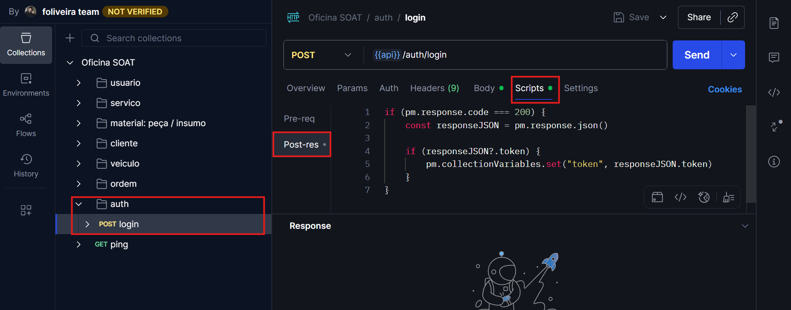
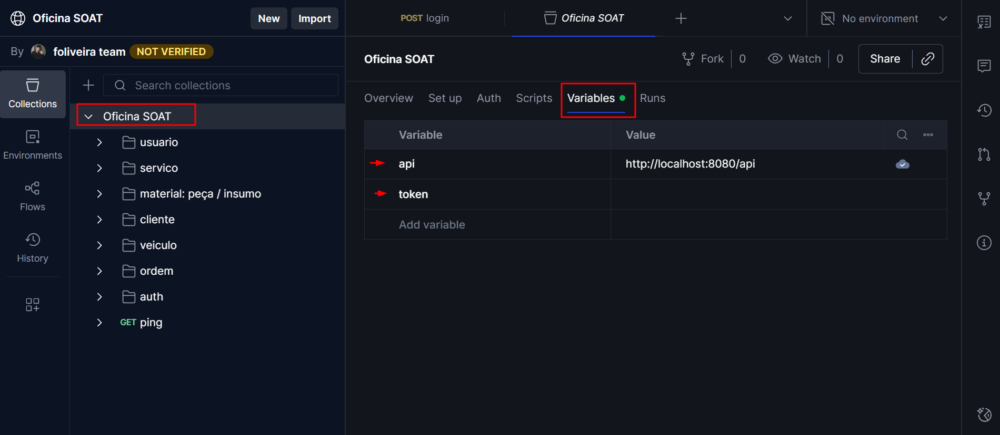
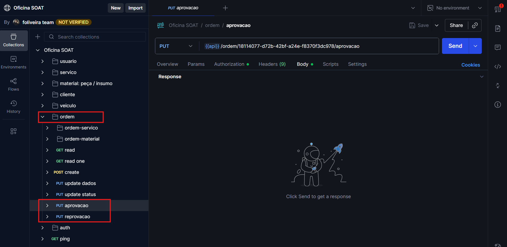
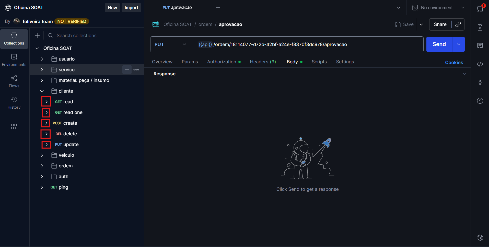
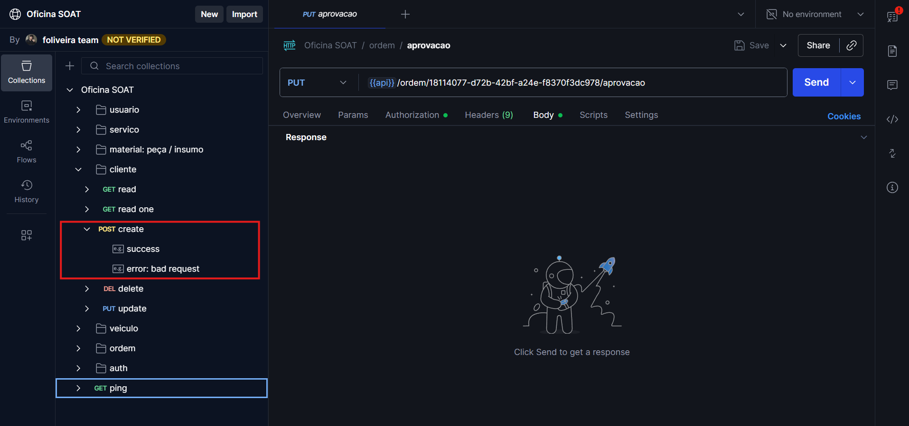
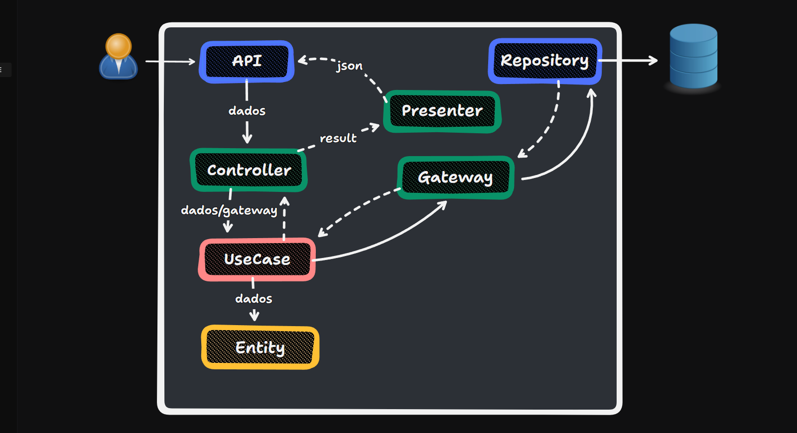

# Setup

Antes de fazer o clone do projeto, precisamos ter em mente algumas coisas:

Como especificado no arquivo [docker-compose.yaml](./docker-compose.yml), um container de postgres será criado na porta padrão (`5432`) com mapeamento `5432:5432` (`host:container`).

 O nginx está configurado para fazer o proxy reverso para o container de php (veja o arquivo [nginx.conf](./build/server/nginx.conf) para mais detalhes). É pelo container de nginx que a api é acessada, então quando tudo estiver pronto, você poderá acessar `http://localhost:8080/api` e como teste rápido, acessar o endpoint `http://localhost:8080/api/ping`. O resultado esperado é a seguinte response:

 ```json
 {
    "msg": "pong",
    "err": false
 }
 ```

 É importante que você esteja certo de que as portas `5432` e `8080` no seu computador estejam liberadas para que esses serviços sejam alocados corretamente nelas. Caso contrário, certamente erros irão ocorrer. Uma alternativa será editar o [docker-compose.yaml](./docker-compose.yml) mudando as portas de host dos serviços, para portas que estejam liberadas na sua máquina.


Clone este repositório
```sh
git clone git@github.com:felipeoli7eira/oficina-soat.git
```

Entre na pasta criada
```sh
cd oficina-soat
```

Suba os containers
```sh
docker compose up -d --build
```

O resultado esperado é que 3 containers estejam em pleno funcionamento:
- php (9000/tcp)
- nginx (0.0.0.0:8080->80/tcp)
- postgres (0.0.0.0:5432->5432/tcp)

Agora, como dito anteriormente, você pode tentar acessar o endpoint `http://localhost:8080/api/ping` e verificar se a api responde com "pong".

# API Documentation

O [postman](https://www.postman.com) foi usado para criar a documentação da API. O workspace com a collection está [disponível aqui](https://app.getpostman.com/join-team?invite_code=a8f7c5db50618a4d057b1e50ca129cef16d68fbd74f03c9d4f532c18e9fff4c3&target_code=0249e09988430bb18a9413c8067664c2). Você notará que cada recurso está organizado em pastas:

- pasta `usuario`: CRUD de usuários do sistema (mecânicos, atendentes, etc...)
- pasta `servico`: CRUD de serviços da oficina, como troca de óleo, revisões e etc...
- pasta `material: peça / insumo`: CRUD de materiais (peças e insumos) usados nas ordens de serviço, como pastilha de freio, filtros de ar e óleo, etc...
- pasta `cliente`: CRUD de clientes da oficina
- pasta `veiculo`: CRUD de veículos dos clientes
- pasta `ordem`: CRUD da ordem de serviço
- pasta `auth`: Autenticação de usuários do sistema.

No momento da inicialização dos containers mapeados no [docker-compose.yaml](./docker-compose.yml), a base de dados é populada com um usuário de teste, como descrito no arquivo [DatabaseSeeder.php](./backend/database/seeders/DatabaseSeeder.php). Você pode usar os dados desse usuário para obter um token JWT e testar todo os fluxos da API. Os dados desse usuário são os seguintes:

- Usuário: `soat@example.com`
- Senha: `padrao`

A pasta `auth` contém um único endpoint nomeado "login". É esse endpoint que você vai usar para obter um token JWT. O postman nos oferece algumas features muito legais, uma delas é a execução de scripts pré e pós request. O endpoint "login" dentro da pasta `auth` tem um script pós requisição, que basicamente pega o token jwt devolvido, e salva na variável de ambiente "token".



Sendo assim, você não precisa copiar o token devolvido, ir nas variáveis de ambiente e colar como valor. Isso é feito automaticamente na devolução dele na responde do endpoint.

Falando em variáveis de ambiente, todas as variáveis de ambiente estão em contexto de collection. Isso significa que a collection quando exportada ou importada (que não é o caso aqui) já vai com as variáveis junto.



A maior parte dos endpoints da API, estão protegidos por um middleware que exige que um token JWT válido seja informado, exceto o endpoint `/ping` que é para teste rápido, e os endpoints de aprovação ou reprovação de uma ordem de serviço informada como parâmetro de URL, conforme exemplificado nos endpoints:



Um último ponto sobre a documentação da API, é que ela tem exemplos de resposta de sucesso e erro para cada endpoint:



Clique nas setinhas em cada endpoint para ver os exemplos de respostas:



# Clean architecture

O projeto foi organizado usando clean architecture. Essa organização pode ser vista dentro da pasta `backend/app` e vamos entrar em detalhesa agora.

- Entidades e casos de uso: `backend/app/Domain`
- Controllers (da clean arch): `backend/app/Infrastructure/Controller`
- Gateway: `backend/app/Infrastructure/Gateway`
- Presenters: `backend/app/Infrastructure/Presenters`
- Camadas mais externas:
    - Banco de dados: `backend/app/Infrastructure/Repositories`
    - Web: `backend/app/Http/`

Algumas boas práticas e padrões foram adotados para desenvoler o projeto, como por exemplo clean code, SOLID, Repository pattern e Object Calistenics.

Nossos métodos possuem nomes simples e claros, que demonstram o que fazem, como por exemplo:
```php
    public function validarNome(): void
    {
        if (strlen(trim($this->nome)) < 3) {
            throw new InvalidArgumentException('Nome deve ter pelo menos 3 caracteres');
        }
    }
```

Codificamos para interfaces e não para implementações concretas, como é o caso da interface que gera o JWT:
```php
interface TokenServiceInterface
{
    public function generate(array $claims): string;
    public function validate(string $token): ?JsonWebTokenFragment;
    public function refresh(string $token): string;
    public function invalidate(string $token): void;
}
```

Nossas dependências são de fora para dentro:



Nossas regras de negócio estão seguras nos _use cases_ e _enenties_, conforme deve ser.
